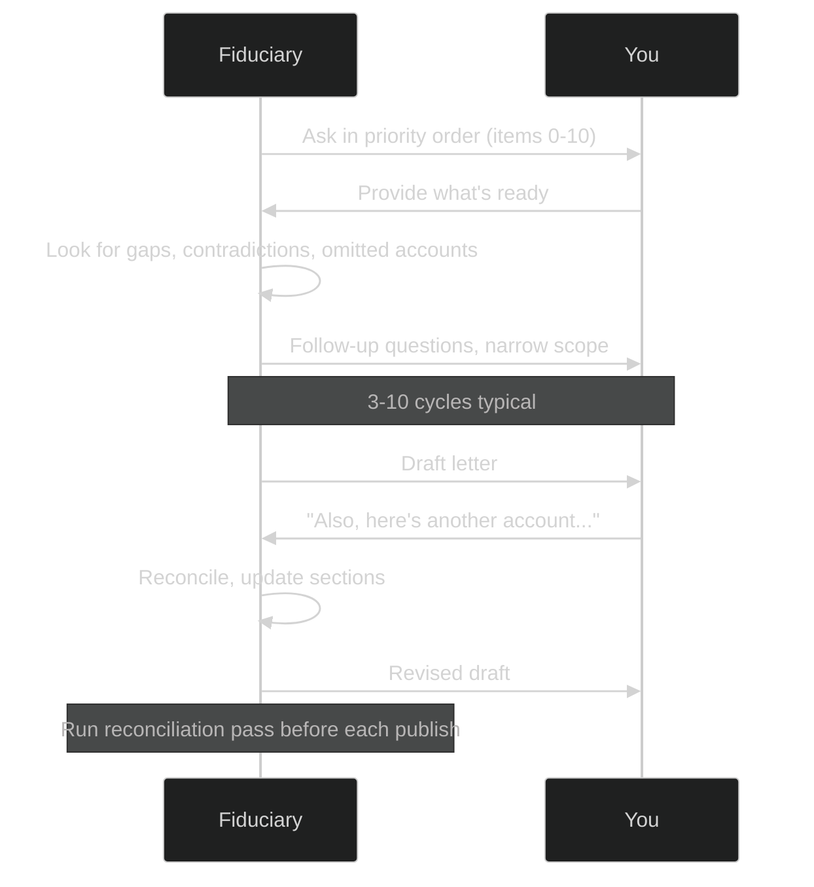
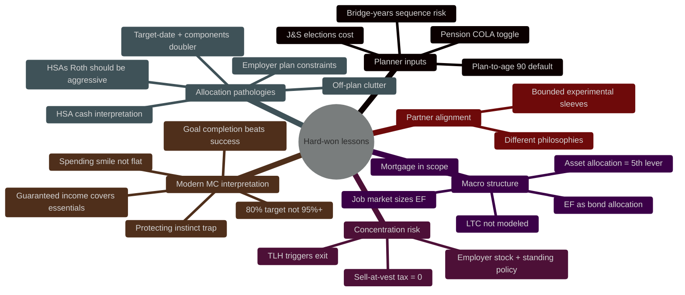

# Fiduciary

A system prompt that turns a frontier LLM into a **retirement-planning
fiduciary** — a focused, evidence-grounded thinking partner for reviewing
your household's retirement readiness. Not to be used as the sole planning
tool. I personally use it to compare against other tools like Fidelity's
built-in planner.

It's grounded in the [Bogleheads](https://www.bogleheads.org/) investment
philosophy (low-cost, broadly-diversified, behaviorally-disciplined
investing) and is designed to behave like a fiduciary: acting in *your*
interest, citing its sources, surfacing uncertainty, and refusing to
freelance numbers.

## When to use it

- You want a structured second or third opinion on your plan.
- You want to think out loud with an AI that won't try to sell you anything,
  won't hand-wave numbers, and will tell you when it's outside its lane.
- You're helping a family member do the same.

## What it is *not*

- Not financial, tax, or legal advice. Use it to prepare better questions
  for a fee-only, fiduciary-bound CFP, EA/CPA, or estate attorney — not to
  replace them.
- Not a calculator. It will pull numbers from authoritative sources (SSA,
  IRS, your plan documents) and walk you through scenarios, but the math is
  only as good as the inputs you give it.

## How to use it

1. **Open a fresh chat** with a frontier LLM (Claude, GPT, Gemini, etc.)
   that has web browsing or tool use enabled if possible.
2. **Paste the entire contents of [`Fiduciary.md`](Fiduciary.md)** as your
   first message (or as a system prompt if your tool supports that).
3. **Follow its lead.** It will start by asking what to gather and how you
   want to work together.

## How the conversation will flow

A typical review takes 3-10 back-and-forth cycles as you share more data and the AI surfaces follow-up questions. The AI runs a reconciliation pass before each draft to catch stale numbers and internal contradictions.

## What the AI applies throughout

The prompt encodes a set of "hard-won lessons" — recurring patterns the AI looks for and applies as it analyzes your data. Grouped by theme:

*(Colors are decorative — each branch is one theme; the labels carry the meaning.)*

The full text of each lesson lives in `Fiduciary.md` under the "Hard-won lessons" section.

---

## What to gather before you start

You don't need all of this on day one — the AI will ask. But the more you
have ready, the faster the review goes.

### Formats that work for any modern AI assistant

- **Screenshots (PNG / JPG)** — paste directly into the chat. Most planner
  UIs, brokerage holdings pages, and pension estimator outputs are easier to
  capture this way than to retype. The AI reads them directly.
- **PDFs** — monthly/quarterly statements, official benefit estimates,
  mortgage notes. Upload as-is; the AI will pull the numbers out.
- **CSVs** — most brokerages let you export positions, transactions, or
  contribution history. Best for accounts with many holdings.
- **Plain typed numbers** — fastest for one-off figures (your monthly burn,
  your SS estimate, an account balance you already know off the top of your
  head).
- **A private note** (Notion / Apple Notes / a markdown file) where you
  pre-stage the inputs before pasting them in. Useful if you'd rather not
  paste everything into the chat history.

> ⚠️ **Redact before sharing.** Account numbers, full SSNs, full DOBs, and
> addresses aren't needed for analysis. Crop or black them out of
> screenshots; delete those columns from CSVs. The AI doesn't need them and
> you don't want them sitting in a chat log.

### Household snapshot

- Both partners' ages, jobs, employers, approximate gross income, and how
  stable each job is right now.
- Children / dependents and any large planned expenses (college, eldercare,
  etc.).
- City / state (affects taxes, pensions, healthcare cost assumptions).
- *How to capture:* just type it. One short paragraph per partner is enough.

### Every account, both partners, joint and individual

For each account, capture: account name, type (401(k), IRA, Roth IRA, HSA,
taxable brokerage, ESPP, state DC plan, etc.), current balance, **the full
positions list** (every holding with ticker, dollar amount, and % of
account — not just "stocks 60%, bonds 40%"), contribution rate, and any
employer-plan fund-menu constraints.

If the account has a **written target allocation** (a spreadsheet, an
investment policy statement, a personal note about "this is the mix I
want") — share it. Even rough notes are useful. The gap between target and
actual is one of the highest-leverage places to find recoverable fixes.

*How to capture:*

- **Fidelity / Vanguard / Schwab / E*TRADE / Empower / etc.** — log in,
  open the Positions or Holdings page for each account, take a full-page
  screenshot. That single screenshot usually has the balance, the ticker
  breakdown, and the dollar amounts in one shot. Paste each screenshot into
  the chat with one line: *"This is my 401(k)"* / *"This is my taxable
  brokerage."*
- **Employer 401(k) fund menu** — if your plan has a fixed set of funds,
  screenshot or PDF-export the fund lineup page. The AI needs to know what
  you *could* hold, not just what you do hold.
- **HSA** — same drill; flag if any portion is held as cash (it usually is,
  and it usually shouldn't be). Also flag whether new contributions are
  being auto-invested or accumulating as cash.
- **ESPP / vested company stock / RSUs** — capture share count, current
  price, and cost basis if you have it. Screenshot from your equity platform
  (E*TRADE, Schwab Equity Awards, Morgan Stanley at Work, Fidelity
  NetBenefits, etc.).
- **Many accounts? Export a CSV.** Most brokerages have a "Download
  positions" or "Export" button on the holdings page.
- **Target allocation docs** — if you have a spreadsheet or note describing
  how you *intend* each account to be allocated, paste it. The AI will
  compute target-vs-actual gaps as part of the analysis.

### Pensions (defined-benefit), both partners

For each pension: plan name and sponsor, all election options (Single Life,
J&S 50/75/100%) with dollar amounts, COLA / inflation-adjustment terms,
election date, and the primary-source URL for the plan.

*How to capture:*

- Log into your pension system's portal (e.g., a state DRS / CalPERS / TRS
  site, or your employer's pension administrator).
- Run the plan's **official benefit estimator** at your target retirement
  age. Most produce a one-page summary with every election option
  side-by-side — screenshot or PDF that page. **This is the single
  highest-leverage document in the whole review.**
- Find and link the plan's COLA / post-retirement-adjustment page from the
  plan's own site (not a third-party summary). The COLA terms vary wildly
  across plans and the AI must verify them.
- If you don't have a portal account, request a written benefit estimate
  from the plan administrator — most will mail one within a few weeks.

### Social Security

- Each partner's estimates at Age 62 (early), Full Retirement Age (FRA),
  and Age 70 (delayed).
- *How to capture:* log into [ssa.gov/myaccount](https://www.ssa.gov/myaccount/)
  for each partner. Screenshot the "Plan for Retirement" page that shows
  the three age tiers. **Use fresh numbers** — old estimates assume
  continued earnings that may no longer be accurate.

### Mortgage / housing

- Balance, rate, fixed vs. ARM, ARM reset date if applicable, term, monthly
  P&I payment, property tax + insurance escrow.
- Rough property value.
- Whether you'd consider downsizing or reverse mortgage as a late-life
  backstop.
- *How to capture:* one screenshot of your servicer's account-summary page
  (the dashboard that shows current balance, rate, and next payment) usually
  covers most of it. For an ARM, also screenshot or PDF the **note's reset
  terms** — most servicers have a "Loan Details" or "Original Documents"
  section. Zillow / Redfin estimate is fine for property value.

### Emergency fund

- Where it lives, how much, what tier (instant cash, HYSA, short Treasuries,
  T-Bill ladder, I-Bonds, money-market funds, etc.).
- Realistic monthly household burn.
- Job-market context for both partners — is the EF sized for a benign
  environment, or a harsh one?
- *How to capture:* type the breakdown directly (e.g., *"$15k Ally HYSA,
  $40k T-Bill ladder, $5k checking buffer"*). For monthly burn: if you use
  Monarch / Copilot / YNAB / Mint, screenshot the last 3 months of total
  spending; otherwise estimate from your credit card + mortgage statements.

### Existing planner output (if any)

- Screenshots from whatever Monte Carlo tool you've already run (Fidelity
  Retirement Planner, Vanguard Retirement Income Calculator, Empower,
  NewRetirement, ProjectionLab, etc.).
- The inputs you used (plan-to-age, expense target, how pensions were
  modeled, how Social Security was modeled).
- *How to capture:* screenshot **both** (a) the headline results page (the
  probability number, the year-by-year chart, the bad-tail scenario), **and**
  (b) the inputs/assumptions page. The AI needs both to interpret honestly.
  If you haven't run a planner yet, that's fine — the AI will walk you
  through it.

### Partner's investing philosophy (critically important)

If your partner has a different framework — contrarian, international-tilted,
gold/crypto-leaning, real-estate-heavy, anti-Bogleheads, runs a small
speculative sleeve, has strong views on US-market exceptionalism, etc. —
capture it.

- *How to capture:* a separate markdown / text file works well
  (`Partner-Philosophy.md` or similar). Even rough notes are useful. If your
  partner already has a written framework or investment policy statement,
  share it as-is. Ask them directly: *"If you had to explain how you think
  about money in three paragraphs, what would you write?"* Their answer is
  the input.
- **Do this early.** Discovering a partner's philosophy late in the process
  forces a rewrite. Treat it as a first-class input, not noise.

---

## Offline grounding (optional)

The prompt prefers live web fetches of Bogleheads wiki articles for
grounding. For users without browsing tools, an offline mirror of the wiki
is planned as a separate companion repo — see the "Appendix: Offline
grounding" section at the bottom of `Fiduciary.md` for details and current
status.

## A note on "fiduciary"

Real-world fiduciaries (RIAs, CFPs operating under fiduciary rules, ERISA
plan administrators) are bound by **law** to act in your interest. An LLM
is not, cannot be, and shouldn't pretend to be one. The prompt asks the
model to *behave* like a fiduciary — to adopt the posture, citation
discipline, and uncertainty-flagging norms — as a north star for how it
should think and respond.
